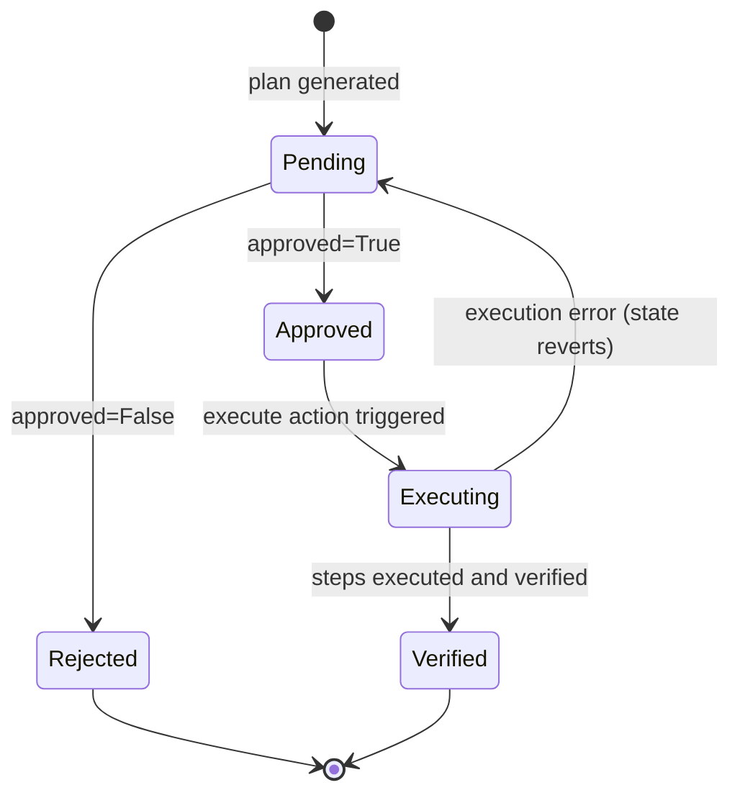
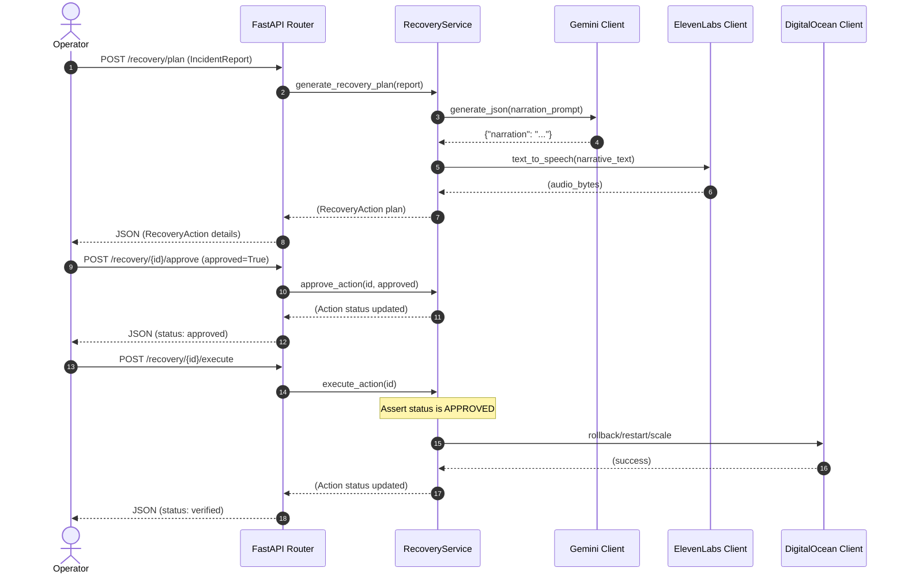
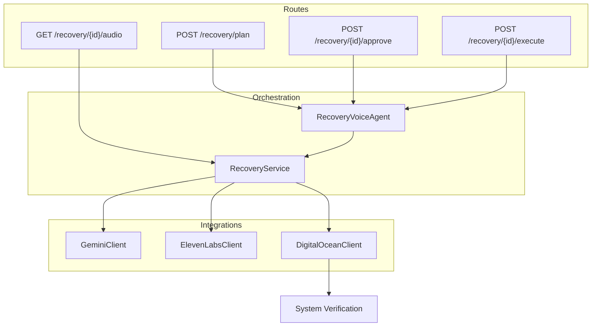

# Recovery & Voice Approval Agent (Agent 4)

## Overview
The **Recovery & Voice Approval Agent** (Agent 4) is the automated execution and human-in-the-loop safety boundary for the OpsForge-Burner platform. It consumes root cause analyses produced by the upstream Telemetry & Root Cause Agent (Agent 3) and manages the mitigation phase of the incident lifecycle.

---

## Purpose
Agent 4 exists to convert abstract root cause explanations into concrete, actionable steps, translate these plans into natural voice narration, request explicit confirmation from system operators, execute recovery commands safely, and verify that the system returns to its healthy baseline.

---

## Responsibilities
- **Strategy Extraction**: Receive telemetry-correlated `IncidentReport` objects containing ranked `RecoveryRecommendation` lists.
- **Narrative Generation**: Use Gemini to transform technical incident diagnostics into clear, conversational voice scripts.
- **Voice Synthesis**: Call ElevenLabs to synthesize MP3 audio narrations of the incident and recommended mitigations.
- **State Coordination**: Track and enforce the lifecycle states of recovery plans from generation through approval to completion.
- **Safe Execution**: Prohibit automated execution. Enforce manual operator confirmation via API or voice command.
- **Infrastructure Orchestration**: Scale resources, trigger restarts, or update application specifications in DigitalOcean.
- **Automated Verification**: Poll and execute readiness checks, validating that the target system returns to a functional state.

---

## Position inside OpsForge
Within the OpsForge loop, Agent 4 bridges the analytical phase (Agent 3) and the permanent memory store (Agent 5). 

```
[Agent 3: Telemetry/RCA] ──(IncidentReport)──> [Agent 4: Recovery/Voice] ──(State/Audit)──> [Agent 5: Memory]
                                                    │
                                                    ├──(Voice/UI)──> [Operator Approval]
                                                    │
                                                    └──(Mitigate)──> [DigitalOcean Infra]
```

---

## High-Level Workflow
1. **Ingestion**: Accepts an `IncidentReport` POST payload.
2. **Analysis & Selection**: Identifies the highest-ranked (Rank 1) recovery recommendation.
3. **Voice Prep**: Requests Gemini to generate a verbal script and calls ElevenLabs to generate an MP3 audio narration.
4. **Operator Gate**: Places the plan in `pending` state and blocks execution until explicit approval is received.
5. **Mitigation**: Once approved, updates state to `executing` and invokes infrastructure actions.
6. **Verification**: Executes verification commands to confirm health parameters.
7. **Resolution**: Marks state as `verified` and registers the completion audit log.

---

## Complete Recovery Lifecycle
1. **Report Received**: Raw telemetry is mapped into recovery actions.
2. **Plan Generated**: In-memory instance and audio file caching keys are initialized.
3. **Approval Submitted**: Operator provides a confirmation parameter via `/recovery/{action_id}/approve`.
4. **Execution Dispatched**: The pipeline executes tasks and updates the status of each step from `pending` to `running` to `completed`.
5. **Post-Incident Checks**: Validates system metrics and sets the status to `verified`.

---

## Architecture Overview
Agent 4 is constructed using the following layered architecture:

```
  ┌────────────────────────────────────────────────────────┐
  │                     FastAPI Routes                     │
  └───────────┬────────────────────────────────┬───────────┘
              │                                │
  ┌───────────▼───────────┐        ┌───────────▼───────────┐
  │   RecoveryVoiceAgent  │        │     RecoveryService   │
  └───────────┬───────────┘        └───────────┬───────────┘
              │                                │
              └───────────────┬────────────────┘
                              │
  ┌───────────────────────────▼────────────────────────────┐
  │                  Integration Clients                   │
  │     [GeminiClient]   [ElevenLabs]   [DigitalOcean]     │
  └────────────────────────────────────────────────────────┘
```

---

## Internal Architecture
- **API Boundary**: FastAPI endpoint definitions receiving requests and returning aliases mapped to frontend types.
- **Agent Orchestrator**: High-level wrapper class containing the workflow entry points (`create_recovery_plan`, `process_approval`, `execute_recovery`).
- **Service Layer**: State store, Gemini response parser, step mapper, and execution timer.
- **Client boundaries**: Outgoing API connection wrappers with robust simulation logic.

---

## Repository Structure
- **[recovery_voice.py](file:///e:/OpsForge-Burner/backend/app/agents/recovery_voice.py)**: Coordinates high-level workflows.
- **[recovery_service.py](file:///e:/OpsForge-Burner/backend/app/services/recovery_service.py)**: Handles plans mapping, caching, state transitions, and step executions.
- **[recovery.py](file:///e:/OpsForge-Burner/backend/app/routes/recovery.py)**: Exposes endpoints for planning, status checks, approvals, execution triggers, and audio files.
- **[recovery.py](file:///e:/OpsForge-Burner/backend/app/schemas/recovery.py)**: Defines Pydantic data schemas with camelCase aliases.
- **[elevenlabs_client.py](file:///e:/OpsForge-Burner/backend/app/integrations/elevenlabs_client.py)**: Calls ElevenLabs API or falls back to logger-based simulations.
- **[digitalocean_client.py](file:///e:/OpsForge-Burner/backend/app/integrations/digitalocean_client.py)**: Integrates with DO REST App Platform API or falls back to step simulations.
- **[config.py](file:///e:/OpsForge-Burner/backend/app/utils/config.py)**: Manages env settings for DO and ElevenLabs credentials.
- **[test_recovery_agent.py](file:///e:/OpsForge-Burner/backend/tests/test_recovery_agent.py)**: Contains unit tests validating state machine transitions and routing paths.

---

## Internal Components

### `RecoveryVoiceAgent`
Coordinates high-level entry points.
* `create_recovery_plan(report: IncidentReport) -> RecoveryAction`: Generates steps, writes voice scripts, and synthesizes audio.
* `process_approval(action_id: str, request: RecoveryApprovalRequest) -> RecoveryAction`: Transitions approval status.
* `execute_recovery(action_id: str) -> RecoveryAction`: Directs the execution flow and returns verified states.

### `RecoveryService`
Contains core logic and cached data maps.
* `generate_recovery_plan(report: IncidentReport) -> RecoveryAction`: Processes recommendations, requests Gemini narrations, and generates MP3s.
* `approve_action(action_id: str, request: RecoveryApprovalRequest) -> RecoveryAction`: Updates state and logs audit logs.
* `execute_action(action_id: str) -> RecoveryAction`: Asserts approvals, updates active steps, and runs actual or simulated cloud commands.

### `ElevenLabsClient`
Wraps the TTS integration.
* `text_to_speech(text: str) -> bytes`: Issues text-to-speech conversion requests or runs local logs and mock mp3 prefix output.

### `DigitalOceanClient`
Wraps DigitalOcean API connection.
* `rollback_deployment(app_id: str, deployment_id: str) -> dict`: Triggers App Platform rollback.
* `restart_application(app_id: str) -> dict`: Issues forced redeploys.
* `scale_service(app_id: str, service_name: str, replicas: int) -> dict`: Modifies service specs and submits updates.

---

## Request Flow
1. Operator submits `IncidentReport` from Agent 3 via `POST /recovery/plan`.
2. `RecoveryService` matches recommendation category, constructs steps, and queries Gemini.
3. Gemini returns narrative text; `ElevenLabsClient` produces binary MP3 audio.
4. Action and audio bytes are stored in thread-safe memory maps; a `pending` JSON object is returned to the client.
5. The operator listens to the audio or reviews the plan, and submits approval via `POST /recovery/{action_id}/approve`.
6. Operator triggers execution via `POST /recovery/{action_id}/execute`.
7. Steps run sequentially (simulating or invoking DigitalOcean APIs) and are marked `completed`.
8. The final status transitions to `verified` and is logged to the audit log.

---

## State Machine


Valid transitions are strictly enforced in the service layer. An execution trigger submitted to a `pending` or `rejected` plan returns a `400 Bad Request`.

---

## API Endpoints

### `POST /recovery/plan`
- **Purpose**: Map an incident report to a plan, write narration, and synthesize audio.
- **Request Body**: `IncidentReport` (JSON)
- **Response**: `201 Created` with `RecoveryAction` schema.
- **Errors**: `400 Bad Request` if `deployment_id` is missing or report contains no recommendations.

### `GET /recovery/{action_id}`
- **Purpose**: Get current status and details of a recovery action.
- **Response**: `200 OK` with `RecoveryAction`.
- **Errors**: `404 Not Found` if `action_id` is unknown.

### `POST /recovery/{action_id}/approve`
- **Purpose**: Submit operator decision.
- **Request Body**: `RecoveryApprovalRequest` (approved: bool, approver: str, approvalMode: str)
- **Response**: `200 OK` with updated `RecoveryAction` (status: `approved` or `rejected`).
- **Errors**: `404 Not Found`.

### `POST /recovery/{action_id}/execute`
- **Purpose**: Trigger step execution.
- **Response**: `200 OK` with updated `RecoveryAction` (status: `verified`).
- **Errors**: `400 Bad Request` if not approved. `500 Internal Server Error` if API calls fail.

### `GET /recovery/{action_id}/audio`
- **Purpose**: Stream the generated narration voice MP3 file.
- **Response**: `200 OK` with `audio/mpeg` binary content.
- **Errors**: `404 Not Found` if audio is missing.

---

## DigitalOcean Integration
If `DIGITALOCEAN_API_TOKEN` is loaded from the environment:
- **Rollback**: Invokes `POST /v2/apps/{app_id}/deployments` with `rollback_to_deployment_id`.
- **Restart**: Invokes `POST /v2/apps/{app_id}/deployments` with `force_rebuild=True`.
- **Scaling**: Fetches application specifications via `GET /v2/apps/{app_id}`, updates service replicas counts, and PUTs back updated specifications.

If the token is missing, the client automatically acts in **Simulation Mode**, logging the parameters and returning a simulated success response immediately.

---

## ElevenLabs Integration
- **Narration**: Feeds incident data into Gemini requesting a JSON structure with a single key `narration`.
- **Audio Generation**: Sends narrative text to ElevenLabs endpoint `/v1/text-to-speech/{voice_id}`.
- **Fallback**: If ElevenLabs key is missing, logs speech text to console and caches mock audio bytes.

---

## Gemini Integration
Gemini generates spoken narrations using the following template prompt:
```
Generate a conversational 2-3 sentence speech script for an operator to approve recovery action.
App: {report.app_name}
Incident: {report.root_cause}
Fix: {recommendation.action}
Confidence: {confidence}%
Request voice/UI approval at the end.
```
If Gemini API encounters timeout or parsing issues, a programmatic string format is generated as a fallback.

---

## Recovery Execution
- **Selection**: Matches recommendation category from `rollback`, `restart`, `scale_up`, and `manual`.
- **Execution Order**: Performs steps in logical order, setting the status of active steps to `running` and updating to `completed` on success.
- **Safety Gate**: Ensures `status == 'approved'` before initiating actions.
- **Verification**: Executes health checks and returns a `verified` status.

---

## Verification Process
Each plan concludes with a verification checklist step (typically Step 4). The verification verifies:
- Pod scaling and replica distribution checks.
- DB pools patch configurations.
- HTTP baseline health probe checks.

The action completes when all steps are marked `completed` and `verified = True`.

---

## Environment Variables

| Variable | Purpose | Required | Default | Example |
|---|---|---|---|---|
| `DIGITALOCEAN_API_TOKEN` | DigitalOcean App Platform Authorization | No (simulated if empty) | None | `dop_v1_abc123...` |
| `ELEVENLABS_API_KEY` | ElevenLabs text-to-speech API authorization | No (simulated if empty) | None | `el_key_xyz...` |
| `ELEVENLABS_VOICE_ID` | Voice ID used for TTS narration | No | `21m00Tcm4TlvDq8ikWAM` | `pNInz6obpmj51Rpaa8F` |

---

## Data Models

### `RecoveryStep`
- `id` (str): Unique identifier.
- `order` (int): Sequential index.
- `title` (str): Descriptive step title.
- `command` (Optional[str]): Simulated terminal execution.
- `verified` (bool): Completion indicator.
- `status` (str): Status string (`pending`, `running`, `completed`, `failed`).

### `RecoveryAction`
- `id` (str): Unique action identifier.
- `incidentId` (str): Associated deployment/incident ID.
- `title` (str): Strategy title.
- `description` (str): Plan details.
- `steps` (List[RecoveryStep]): Sequence of steps.
- `riskLevel` (str): `low`, `medium`, or `high`.
- `status` (RecoveryStatus): State machine value.
- `estimatedDuration` (str): Time estimate.
- `approvedBy` (Optional[str]): Approver operator name.
- `executedAt` (Optional[str]): ISO timestamp.
- `narrative` (Optional[str]): Voice narration script.
- `audioUrl` (Optional[str]): Streaming link.

---

## Error Handling
- **Validation**: Pydantic validates payload schemas, throwing `422 Unprocessable Entity` on mismatch.
- **API Failures**: Handles network issues with `502 Bad Gateway` for Gemini/ElevenLabs, or logs mock statements.
- **Recovery & Approval Safety**: Submitting execution on unapproved plans triggers a `400 Bad Request` validation block.

---

## Logging
- **Workflow Logging**: Tracks plan initialization and step execution steps.
- **Audit Logs**: Generates explicit records for security compliance tracking:
  - `[AUDIT LOG] RecoveryAction 'REC-1234' APPROVED by 'OperatorName' via 'ui'.`
  - `[AUDIT LOG] Starting execution of RecoveryAction 'REC-1234' against DigitalOcean.`
  - `[AUDIT LOG] RecoveryAction 'REC-1234' execution completed and system verified.`

---

## Security
- **Approval safety**: Requires operator validation before execution.
- **Execution protection**: Enforces sequential step limits.
- **Secrets**: Keeps environment API tokens protected inside environment wrappers.

---

## Testing
Unit tests are implemented in `tests/test_recovery_agent.py`:
- `test_recovery_plan_generation_success`: Verifies correct matching and details.
- `test_recovery_plan_generation_gemini_fallback`: Tests fallback template narration when Gemini API is unavailable.
- `test_recovery_approval_state_transitions`: Asserts transition parameters.
- `test_execution_safety_rules`: Verifies safety block preventing unapproved plan execution.
- `test_execution_success`: Validates simulation workflow run.
- `test_api_plan_creation_and_routing`: Validates route creation structures.
- `test_api_approval_and_execution_lifecycle`: Validates full route workflows.
- `test_api_audio_stream_endpoint`: Confirms correct retrieval of cached audio binary bytes.

---

## Dependencies
- **Internal**: `FastAPI`, `Pydantic` (v2), `httpx`, `python-dotenv`, `pytest`, `pytest-asyncio`
- **External**: Gemini API, ElevenLabs API, DigitalOcean App Platform API

---

## Sequence Diagram


---

## Component Diagram


---

## Extension Points
- **New Recovery Categories**: Add new enums in `IncidentReport` and corresponding step mapping lists in `RecoveryService.generate_recovery_plan`.
- **Alternate Cloud Integrations**: Replace `DigitalOceanClient` or sub-class it to map commands to AWS, GCP, or Kubernetes clusters.
- **Speech Providers**: Swap ElevenLabs integration with Amazon Polly or OpenAI TTS.

---

## Troubleshooting
- **Missing Audio (404)**: Ensure ElevenLabs synthesis didn't fail. Check application logs for fallback mode records.
- **Unapproved Executions (400)**: Submit approval payload before triggering execution.
- **Failed Gemini Parsing**: Ensure Gemini returns valid JSON matching the format instructions.

---

## Known Limitations
- State cache is stored in-memory and will be cleared when the FastAPI service process restarts.
- DigitalOcean client runs in simulation mode unless API credentials are loaded.

---

## Future Work
- Integration with MongoDB Atlas (Agent 5) to persist state histories and audit logs.
- Voice-based approval processing via inbound phone calls/voice streaming.

---

## Contributing Notes
- Follow standard type annotations for all service and agent variables.
- Write unit tests in `tests/` for any new recovery category mappings.

---

## Conclusion
Agent 4 establishes the execution engine for OpsForge. By enforcing manual gates while coordinating voice narration and multi-node infrastructure tasks, it provides a safe, production-grade automated recovery solution.
