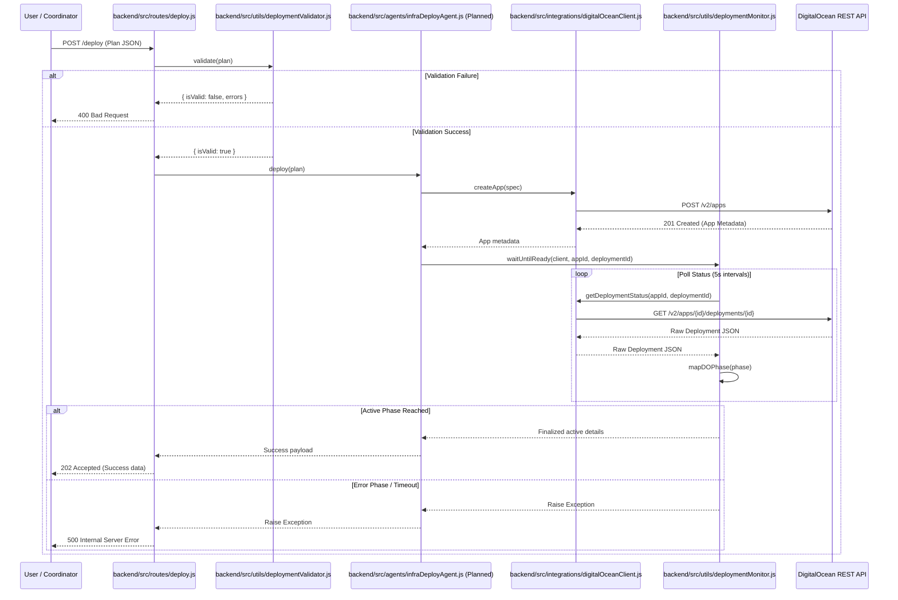
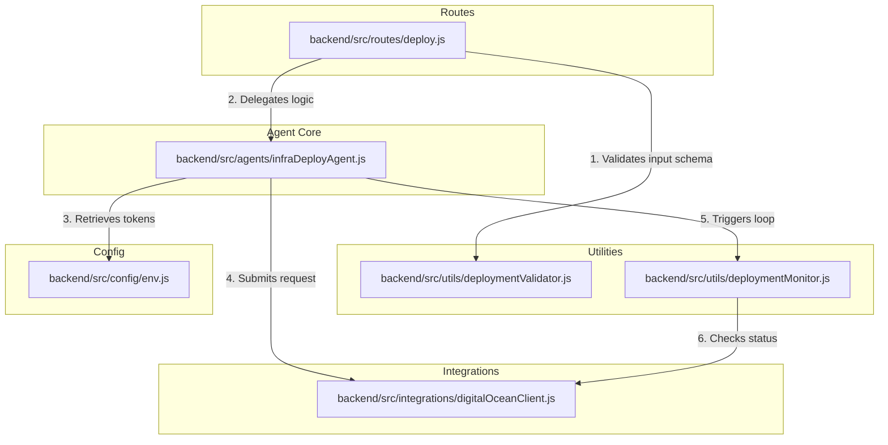

# OpsForge Infra & Deploy Agent (Agent 2) Documentation

# Overview

The **Infra & Deploy Agent (Agent 2)** is the logical infrastructure execution engine of the OpsForge platform. Its primary purpose is to take structured, abstract deployment plans generated by the Deployment Planner (Agent 1) and realize them by provisioning, updating, and monitoring live cloud environments. 

In this implementation, the agent coordinates directly with the **DigitalOcean App Platform** (and optionally DOKS) to spawn services, databases, routing, and environment configurations, translating high-level architecture designs into physical deployments without human intervention unless explicitly requested.

---

# Responsibilities

* **Plan Validation**: Inspects incoming deployment payloads structurally and semantically to ensure all parameters (naming, git URL, ports, region, databases, and scaling limits) are compatible with target cloud services before executing any operations.
* **Infrastructure Provisioning**: Creates and configures application specs for deployment to DigitalOcean App Platform.
* **State & Life-cycle Management**: Updates or deletes existing applications depending on the incoming plan parameters.
* **Active Status Polling**: Monitors running deployment runs, tracking status steps in real-time from initialization through compile (build) stages to deployment execution.
* **Phase Normalization**: Maps native cloud deployment phases to generalized system states (`Pending`, `Building`, `Deploying`, `Active`, `Failed`).
* **Progress Reporting**: Exposes hook notifications to update parent coordinators and user interfaces on deployment status.
* **Environment Fail-Safety**: Ensures configuration settings are fully validated and sanitizes external credentials.

---

# Architecture

The Infra & Deploy Agent uses an asynchronous decoupled modular layer:

```
┌────────────────────────────────────────────────────────┐
│                      HTTP Route                        │
│             (backend/src/routes/deploy.js)             │
└──────────────────────────┬─────────────────────────────┘
                           │ Calls
                           ▼
┌────────────────────────────────────────────────────────┐
│                  InfraDeployAgent                      │
│            (backend/src/agents/infraDeployAgent.js)    │
└────────────┬─────────────┬──────────────┬──────────────┘
             │             │              │
             │ Uses        │ Uses         │ Uses
             ▼             ▼              ▼
┌──────────────────┐ ┌─────────────┐ ┌───────────────────┐
│     Validator    │ │   Monitor   │ │    DO Client      │
│  (validator.js)  │ │(monitor.js) │ │ (digitalOcean.js) │
└──────────────────┘ └─────────────┘ └───────────────────┘
```

1. **API Layer**: Receives HTTP POST commands enclosing deployment plans.
2. **Orchestrator Layer (Agent Core)**: Manages plan verification, client assembly, deployment triggering, status tracking, and formatting return parameters.
3. **Integration Client Layer**: Wraps DigitalOcean HTTP APIs.
4. **Utilities & Monitors**: Separates business policies from validation schemas and polling loops.

---

# Execution Flow

1. **Receiving Request**: The system receives a JSON deployment plan via a POST request to `/deploy`.
2. **Validation**: The route passes the payload to `DeploymentValidator.validate()`. If fields fail validation rules (e.g., invalid characters, invalid Git URL, invalid ports), the request halts immediately and throws an HTTP 400 response with descriptive error logs.
3. **Agent Activation**: The route handler invokes `InfraDeployAgent.deploy()`.
4. **Client Setup**: The agent instances a new `DigitalOceanClient` validated by settings from `env.js`.
5. **App Spec Construction**: The plan parameters are converted into a DigitalOcean App Platform Spec object.
6. **API Provisioning**: The agent issues a `createApp` (or update) request to DigitalOcean.
7. **Polling Initialization**: On successful creation, the agent obtains the application ID and active deployment run ID, then launches `DeploymentMonitor.waitUntilReady()`.
8. **Real-time Status Updates**: The monitor polls DigitalOcean every 5000ms. On each iteration, the raw phase is normalized (e.g. `BUILDING` -> `Building`) and dispatched to the caller via an `onProgress` callback.
9. **Final Result Resolution**: 
   * If the phase transitions to `ACTIVE`, the monitor resolves, and the agent returns a success status object containing application IDs and live target URLs.
   * If the phase becomes `ERROR` / `CANCELED` or the timer crosses the `timeoutMs` threshold, the monitor halts and throws a terminal deployment error.

---

# Repository Structure

```
backend/
├── src/
│   ├── agents/
│   │   └── infraDeployAgent.js         # [FUTURE WORK] Agent 2 coordinator class orchestrating client, monitor, and validator
│   ├── config/
│   │   └── env.js                      # Environment loader, config schema validator, and configuration exporter
│   ├── integrations/
│   │   └── digitalOceanClient.js       # Reusable DigitalOcean App Platform HTTP REST client
│   ├── routes/
│   │   └── deploy.js                   # Express route exposing deployment endpoint and orchestrating request validation
│   └── utils/
│       ├── deploymentMonitor.js        # Polling utility mapping DigitalOcean phases to standard states
│       └── deploymentValidator.js      # Input validator implementing layout constraints for deployment plans
└── tests/
    └── infraDeployAgent.test.js        # Unit test suite verifying agent behaviors, validator rules, and polling timeouts
```

---

# Internal Components

### `env.js`
* **Purpose**: Resolves and validates standard configuration attributes from environment variables.
* **Key Functions**:
  * Manual parsing fallback for environments without Node.js `dotenv` support.
  * Validation rules enforcing that `DIGITALOCEAN_API_TOKEN`, `GEMINI_API_KEY`, `MONGODB_ATLAS_URI`, `ELEVENLABS_API_KEY`, and `JWT_SECRET` must be present.
  * Exports a structured configuration object.

### `digitalOceanClient.js`
* **Purpose**: High-level driver wrapping raw DigitalOcean API interactions.
* **Key Methods**:
  * `createApp(appSpec)`: Posts spec sheet object to `/v2/apps`.
  * `updateApp(appId, appSpec)`: Reconfigures app by ID at `PUT /v2/apps/{id}`.
  * `deleteApp(appId)`: Tears down app platform target at `DELETE /v2/apps/{id}`.
  * `getDeploymentStatus(appId, deploymentId)`: Returns current deployment run metadata.
  * `getLogs(appId, deploymentId)`: Retrieves real-time output streams.
  * `restartDeployment(appId)`: Force deploys latest state.

### `deploymentValidator.js`
* **Purpose**: Performs format assertions on incoming deploy requests.
* **Key Methods**:
  * `validate(plan)`: Checks input keys and yields `{ isValid, errors: string[] }`.

### `deploymentMonitor.js`
* **Purpose**: Coordinates state tracking for active deployments.
* **Key Methods**:
  * `mapDOPhase(phase)`: Normalizes cloud platform phases to standard status tokens.
  * `waitUntilReady(client, appId, deploymentId, options)`: Loops API calls until terminal status or timeout is reached.

### `infraDeployAgent.js` [Future Work]
* **Purpose**: Coordinates validator, DO API requests, and monitor polling.
* **Key Methods**:
  * `deploy(plan, options)`: Main orchestrator logic.

---

# API Endpoints

### `POST /deploy`
Triggered by external client drivers or Agent 1 (Deployment Planner) to request deployment.

#### Request Headers
```http
Content-Type: application/json
```

#### Request Payload Schema
```json
{
  "appName": "my-service-app",
  "repository": "https://github.com/org/repo",
  "branch": "main",
  "runtime": "node",
  "region": "nyc3",
  "ports": [8080],
  "scaling": {
    "instances": 1,
    "size": "basic-xs"
  },
  "env": {
    "NODE_ENV": "production"
  },
  "database": {
    "engine": "mongodb",
    "version": "5.0",
    "size": "db-s-1vcpu-1gb"
  }
}
```

#### Response (Success - HTTP 202 Accepted)
```json
{
  "success": true,
  "message": "Deployment process initiated successfully.",
  "data": {
    "status": "success",
    "appId": "do-app-uuid-123",
    "deploymentId": "deploy-uuid-456",
    "liveUrl": "https://my-service-app.ondigitalocean.app",
    "message": "Infrastructure provisioned and application deployed successfully."
  }
}
```

#### Response (Validation Failure - HTTP 400 Bad Request)
```json
{
  "success": false,
  "message": "Validation failed for deployment plan.",
  "errors": [
    "appName must only contain lowercase alphanumeric characters and dashes (e.g., \"my-app\").",
    "region \"invalid-region\" is invalid. Must be one of: nyc1, nyc3, ams3, sfo2, sfo3, sgp1, lon1, fra1, tor1, blr1."
  ]
}
```

#### Response (Server/Deployment Failure - HTTP 500 Internal Server Error)
```json
{
  "success": false,
  "message": "Deployment failed. DigitalOcean raw phase: ERROR. Reason: Out of memory"
}
```

---

# Deployment Pipeline

```
[PLAN RECEIVAL] ────► [SCHEMA CHECK] ────► [APP SPEC GEN] ────► [DO API POST]
                                                                     │
                                                                     ▼
[RETURN RESULTS] ◄─── [PHASE ANALYSIS] ◄─── [POLL API] ◄────── [POLL LOOP]
```

1. **Ingress Validation**: Matches payload schemas.
2. **Compile Specification**: Normalizes the JSON plan into DigitalOcean API App Specs.
3. **Provisioning POST**: Commits schema to DO App platform.
4. **Asynchronous Monitoring Loop**: Uses timer offsets to check building and deployment tasks.
5. **Egress Translation**: Normalizes completion metrics into the standard system format.

---

# DigitalOcean Integration

All interactions use standard HTTP/1.1 calls against `https://api.digitalocean.com/v2`.

* **Authentication**: Carried out via `Authorization: Bearer ${DIGITALOCEAN_API_TOKEN}` header.
* **App Specification Layout**: Generated dynamically inside the client from deployment configuration schemas.
* **Endpoints Utilized**:
  * `POST /v2/apps` - Creates application components.
  * `PUT /v2/apps/{id}` - Updates application spec.
  * `GET /v2/apps/{id}/deployments/{id}` - Polls execution metrics.
  * `DELETE /v2/apps/{id}` - Destroys provisioned cloud applications.

---

# Environment Variables

| Variable | Purpose | Required | Default Value |
| :--- | :--- | :--- | :--- |
| `DIGITALOCEAN_API_TOKEN` | DigitalOcean OAuth2 user access token. | **Yes** | *None* |
| `DIGITALOCEAN_DEFAULT_REGION` | Regional landing zone for apps. | No | `nyc3` |
| `DOKS_CLUSTER_NAME` | Target cluster identifier for optional Kubernetes deploy. | No | `opsforge-doks-cluster` |
| `DOKS_CLUSTER_REGION` | Kubernetes cluster regional landing zone. | No | `nyc3` |
| `DOKS_KUBERNETES_VERSION` | Target engine revision. | No | `latest` |
| `GEMINI_API_KEY` | Key for parent platform agents. | **Yes** | *None* |
| `MONGODB_ATLAS_URI` | System database cluster target URI. | **Yes** | *None* |
| `ELEVENLABS_API_KEY` | Audio integration key for voice agents. | **Yes** | *None* |
| `JWT_SECRET` | Web token signature secret key. | **Yes** | *None* |
| `BACKEND_HOST` | Local listener binding interface. | No | `127.0.0.1` |
| `BACKEND_PORT` | Local service port binding. | No | `8000` |
| `DEPLOYMENT_POLL_INTERVAL_MS`| Checking pause durations during deployment polling. | No | `5000` |
| `DEPLOYMENT_TIMEOUT_MS` | Maximum duration before monitoring times out. | No | `600000` |

---

# Input Schema

The incoming JSON payload must match the rules in `deploymentValidator.js`:

* `appName` (String, Required): Lowercase alphanumeric and hyphens.
* `repository` (String, Required): Must start with `https://github.com/`, `git@github.com:`, or match a generic HTTP/SSH Git URL pattern.
* `branch` (String, Required): Non-empty string target branch.
* `runtime` (String, Required): Must match or contain one of: `node`, `nodejs`, `python`, `go`, `docker`, `static`, `ruby`, `php`, `java`.
* `region` (String, Required): Valid DO region slug (`nyc1`, `nyc3`, `ams3`, etc.).
* `env` (Object, Optional): Flat JSON containing environment variables. Keys must match standard naming constraints (alphanumeric, starts with letter/underscore).
* `database` (Object, Optional): Requires child `engine` (`mongodb`, `postgresql`, `mysql`, `redis`), with optional version and size configurations.
* `scaling` (Object, Optional): Specifies `instances` (Integer >= 1) and `size` slug.
* `ports` (Array of Integers, Optional): Array of target container listener ports (range 1-65535).

---

# Output Schema

The return payload represents a standard deployment result:

* `status` (String): Outcome status string (e.g. `'success'`).
* `appId` (String): The uuid of the provisioned DigitalOcean Application.
* `deploymentId` (String): The active deployment run ID associated with the app instance.
* `liveUrl` (String): The public URL endpoint assigned by DigitalOcean.
* `message` (String): Context summary descriptive string.

---

# Error Handling

* **Schema Ingress Errors**: Catches schema mismatches and aborts execution before hitting DigitalOcean, raising a descriptive list of validation error logs.
* **Client Request Errors**: Validates response codes. Non-2xx responses reject with the raw HTTP status and DigitalOcean's body message.
* **Polling Failure States**: The monitor actively checks the returned phase code. If it matches `ERROR`, `CANCELED`, `CANCELLED`, or `FAILED`, polling terminates and raises a deployment error with DigitalOcean's failure reason.
* **Timeout Handling**: Tracks the total polling duration. If it exceeds the timeout setting, the polling process stops and raises a timeout exception.

---

# Logging

Logging functionality is currently planned as an architectural improvement (see **Future Work**).
* **Current Behavior**: System errors are thrown up the chain, and Express routes delegate logs to the standard `next(error)` callback. The progress callback `onProgress` bubbles status details and temporary error text up to the execution caller.

---

# Monitoring

Monitoring relies on continuous polling of the deployment state:

```
[Start Deploy] ────► [Map: PENDING] ────► [Map: BUILDING] ────► [Map: DEPLOYING]
                                                                      │
      ┌───────────────────────────────────────────────────────────────┘
      ▼
[Phase Evaluation] ───► ACTIVE ────► [Map: Active] (Success Terminal)
                   ───► ERROR  ────► [Map: Failed] (Failure Terminal)
```

1. **Mapping**: Translates internal DO state flags to simplified deployment phases (`Pending`, `Building`, `Deploying`, `Active`, `Failed`).
2. **Frequency Control**: Configured via `DEPLOYMENT_POLL_INTERVAL_MS` (defaulting to 5000ms).
3. **Guard Rails**: Polling tracks elapsed time against `DEPLOYMENT_TIMEOUT_MS` (defaulting to 10 minutes) and fails fast if the duration is exceeded.

---

# Dependencies

### External Runtime Dependencies
* **Node.js Environment** (Runtime target >= 18.0.0, native `fetch` module).
* **Express.js** (REST API layer).
* **DigitalOcean App Platform API v2**.

### Optional/Development Dependencies
* **dotenv** (Optionally loaded inside environment config for testing).
* **jest** (Required for test orchestration under `backend/tests/`).

---

# Sequence Diagram



---

# Architecture Diagram



---

# Extension Points

* **Cloud Providers**: To deploy to AWS, GCP, or Azure, developers can replace `digitalOceanClient.js` with a generic `CloudClient` interface exposing uniform lifecycle hooks (`createApp`, `updateApp`, etc.) and adapt `infraDeployAgent.js` to dispatch plans based on the target provider.
* **Kubernetes (DOKS)**: DOKS configuration settings are loaded inside `env.js`. Developers can extend the Client and Agent modules to interface with the DigitalOcean Kubernetes Service API (`POST /v2/kubernetes/clusters`) if DOKS support is enabled in the plan.
* **Advanced Monitoring**: `deploymentMonitor.js` supports `onProgress` callbacks. New endpoints (such as WebSockets or Server-Sent Events) can be bound to this callback to push live deployment progress directly to the frontend.

---

# Known Limitations

* **Memory Polling Limits**: Keeping polling timeouts in the application memory event loop blocks runtime resources and causes state loss during service redeployments.
* **Rate Limits**: Sequential polling at short intervals risks exhausting DigitalOcean API limits during high concurrent load.
* **Sync Route Execution**: The HTTP POST handler blocks client responses until the full build is completed on the cloud provider (which can take minutes).
* **Missing Orchestrator Implementation**: The orchestration file `backend/src/agents/infraDeployAgent.js` is missing, requiring execution to bypass the route or mock the agent.

---

# Future Work

* **Orchestration Agent Implementation**: Generate `infraDeployAgent.js` to parse plan inputs into DO App Specs, trigger deployments, and monitor status updates.
* **Background Worker Queue**: Migrate the synchronous monitoring polling loop from the main application process to a background task queue (e.g., BullMQ with Redis).
* **WebSocket Reporting**: Replace REST polling with real-time WebSocket communication to push progress steps to the UI.
* **Logging System Integration**: Add a structured JSON logger (e.g. `winston`) across the integration client and monitoring loops.

---

# Development Notes

* **Running Tests**: Run `npm test` or `npx jest` from the workspace backend folder to execute the unit tests defined in [infraDeployAgent.test.js](file:///e:/OpsForge-Burner/backend/tests/infraDeployAgent.test.js).
* **Mock Environment**: Ensure you copy `.env.example` into a local `.env` file before executing scripts to prevent config validation failures during startup.

---

# Troubleshooting

### Missing Credentials Error
* *Problem*: App crashes on startup with `FATAL CONFIGURATION ERROR`.
* *Handling*: Set all required environment variables listed in the configuration loader (`env.js`) in your active environment or local `.env` file.

### Immediate API Failure
* *Problem*: The deploy route returns an HTTP 500 error instantly after submitting the plan.
* *Handling*: Check your `DIGITALOCEAN_API_TOKEN` validity and inspect the error body returned by the client. Ensure the `appName` doesn't clash with an existing app name on your account.

### Deployment Monitoring Timeout
* *Problem*: The deployment succeeds in the DigitalOcean console, but the system returns a timeout error.
* *Handling*: Ensure your `DEPLOYMENT_TIMEOUT_MS` setting is long enough (greater than 5 minutes) to accommodate slow package builds and image compilation.
