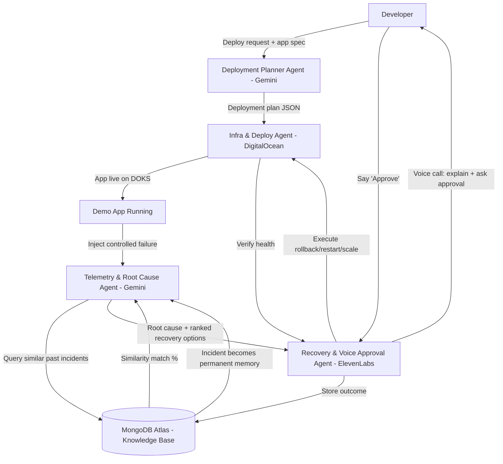

# OpsForge — Team Build Plan
### The Autonomous AI Platform Engineer

> **MLH Track:** Open Innovation
> **Sponsor Prizes Targeted:** Best Use of Gemini API · Best Use of DigitalOcean · Best Use of MongoDB Atlas · Best Use of ElevenLabs

---

## 1. The Pitch (memorize this)

> "OpsForge is an AI Platform Engineer. You push code, it deploys your app to the cloud, and when something breaks at 3am, it investigates the failure, explains what happened in plain English, proposes a fix, and — with your voice approval — recovers the system automatically. Then it remembers the incident forever, so next time it's faster."

**What we are NOT building:** a monitoring dashboard, a chatbot wrapper, or a full 10-agent enterprise platform. We are building **one clean, real, working incident lifecycle** — deploy → break → detect → explain → recover → remember — and demoing it live.

---

## 2. Scope Decision (read this before writing code)

The original concept had 10 agents. For a hackathon, that's a roadmap slide, not a build plan. We are cutting to **5 real agents** that each map to a distinct, demoable capability and a distinct sponsor prize. Everything else becomes "Future Work" in the pitch deck — judges respect an honest scope cut far more than a broken over-promise.

| Cut from MVP | Why |
|---|---|
| Multi-cloud support (AWS/Azure/GCP) | DigitalOcean only — one target, one working demo |
| Repository Intelligence Agent (auto-detect stack) | Hardcode the demo app's stack; mention auto-detection as roadmap |
| Optimization / Architecture Advisor Agent | Nice narrative, not enough time to make it real — fold one paragraph of it into the Root Cause Agent's output instead of a separate agent |
| Fully autonomous execution (no human approval) | Keep the "safe autonomy" story, but every action requires the voice/UI approval step — this is actually a *better* pitch (responsible AI), not a weaker one |

---

## 3. The 5 Real Agents

### Agent 1 — Deployment Planner Agent
**Sponsor: Gemini API**
- Input: a simple app spec (Dockerfile + a short description, e.g. "deploy with Postgres and autoscaling")
- Gemini translates that into a concrete deployment plan (containers, env vars, DB, networking)
- Output: a plan object (JSON) consumed by the Infra/Deploy Agent

### Agent 2 — Infra & Deploy Agent
**Sponsor: DigitalOcean**
- Takes the plan from Agent 1 and provisions real infra: DigitalOcean Kubernetes (DOKS) or App Platform + Managed Postgres
- Deploys the demo app, confirms it's live, streams status back to dashboard

### Agent 3 — Telemetry & Root Cause Agent
**Sponsor: Gemini API**
- Watches logs/metrics from the deployed app (simple polling is fine — no need for a full observability stack)
- When a controlled failure is injected (bad env var / Redis outage / DB connection exhaustion), this agent correlates the signals and asks Gemini to produce a **causal chain explanation**, not just "error detected"
- Output: human-readable root cause + a ranked list of 2–3 recovery options with confidence/risk labels

### Agent 4 — Recovery & Voice Approval Agent
**Sponsor: ElevenLabs**
- Presents the top recovery option via a voice call/message: *"Checkout API latency increased 320%. Likely cause: deployment #48. Recommended action: rollback, 95% confidence. Say 'approve' to continue."*
- On approval (voice or UI button — build both, voice is the wow-moment, UI is the fallback if live voice breaks on stage), executes the action (rollback / restart / scale) against DigitalOcean
- Verifies the fix worked and reports back

### Agent 5 — Knowledge Memory Agent
**Sponsor: MongoDB Atlas**
- Every incident (root cause, recovery chosen, outcome) is stored as a document in MongoDB Atlas
- Use **Atlas Vector Search** to embed incident summaries, so a new incident can be compared against history: *"87% similar to Incident #3 — same fix worked."*
- This is the single easiest "wow, that's real Atlas usage" feature to show — don't skip it, it's cheap to build and very demoable

---

## 4. System Architecture Flow



**Plain-English version of the loop:**

1. Developer submits an app + intent → **Gemini** turns it into a deployment plan
2. **DigitalOcean** provisions and deploys the real infra
3. We inject a failure on purpose (for the demo)
4. **Gemini** investigates, checks **MongoDB Atlas** for similar past incidents, and produces a plain-English root cause + ranked fixes
5. **ElevenLabs** calls/talks to the engineer, explains the situation, asks for approval
6. On approval, the fix executes against **DigitalOcean**, gets verified
7. The whole incident (cause, fix, outcome) is written back to **MongoDB Atlas** — next time, it's faster

---

## 5. Feature List

### Must-have (MVP — build this first, in this order)
1. One demo app (simple Node/Python app) with a Dockerfile
2. Deploy pipeline: spec → Gemini plan → DigitalOcean deployment (working, live URL)
3. One controlled failure scenario, reliably reproducible on demand
4. Root Cause Agent: real Gemini call that takes logs/metrics and produces a causal explanation
5. Recovery UI: shows ranked options with confidence/risk, a big "Approve" button
6. Execution: rollback actually happens on DigitalOcean, dashboard shows before/after health
7. MongoDB Atlas: incident gets stored; at least one working "similar incident" lookup

### Should-have (if time allows)
8. ElevenLabs voice: TTS explanation of the incident (start here — it's simpler)
9. ElevenLabs voice: actual voice *input* approval ("Approve" spoken back) — this is the stretch stage of the same feature, do it only after #8 works
10. Simple auto-postmortem doc generated by Gemini after each incident

### Nice-to-have / cut if short on time
11. Vector search similarity scoring shown as a live percentage in the UI
12. A second failure scenario to prove generality
13. Any architecture-advice paragraph ("splitting X would reduce latency by Y%") — one Gemini call, low cost to add back in if time allows

### Explicitly out of scope (mention only in the pitch as roadmap)
- Multi-cloud support
- Fully unattended/no-approval autonomous execution
- Repository auto-detection of stack
- Dedicated Optimization/Architecture Advisor agent
- Solana integration

---

## 6. Tech Stack

| Layer | Choice | Notes |
|---|---|---|
| Frontend dashboard | React + Tailwind (Vite) | Deployment status, incident feed, recovery approval UI |
| Backend / orchestration | Node.js (Express) or Python (FastAPI) | Coordinates the 5 agents; pick whichever the team is fastest in |
| AI reasoning | **Gemini API** (`gemini-1.5-pro` or latest available) | Deployment planning, root cause reasoning, recovery ranking |
| Infra target | **DigitalOcean** — App Platform (fastest) or DOKS (more impressive if time allows) | Start with App Platform for speed; upgrade to DOKS only if ahead of schedule |
| Database / memory | **MongoDB Atlas** + Atlas Vector Search | Incident history, embeddings, similarity search |
| Voice | **ElevenLabs** (Conversational AI or TTS + simple ASR) | Incident narration + approval flow |
| Demo app (the thing being deployed) | Simple Node/Python app + Redis or Postgres | Needs to fail in a controllable, repeatable way |
| Infra-as-code | Terraform or DigitalOcean API directly | Direct API calls are faster to build for a hackathon than full Terraform |
| Hosting for dashboard/backend | DigitalOcean App Platform | Keeps everything inside one sponsor's ecosystem — good for judging |

---

## 7. Repository / File Structure

```
opsforge/
├── README.md
├── .env.example
├── docker-compose.yml                  # local dev: backend + demo-app + mongo (local mirror)
│
├── demo-app/                           # the sample application OpsForge deploys & "breaks"
│   ├── Dockerfile
│   ├── src/
│   │   └── index.js (or main.py)
│   └── failure-injector/               # scripted, reliable failure triggers for the demo
│       ├── bad-env-var.js
│       └── redis-outage.js
│
├── backend/
│   ├── package.json                    # or requirements.txt
│   ├── src/
│   │   ├── server.js / main.py
│   │   ├── agents/
│   │   │   ├── deploymentPlannerAgent.js     # Agent 1 – Gemini
│   │   │   ├── infraDeployAgent.js           # Agent 2 – DigitalOcean
│   │   │   ├── rootCauseAgent.js             # Agent 3 – Gemini
│   │   │   ├── recoveryVoiceAgent.js         # Agent 4 – ElevenLabs
│   │   │   └── knowledgeMemoryAgent.js       # Agent 5 – MongoDB Atlas
│   │   ├── integrations/
│   │   │   ├── geminiClient.js
│   │   │   ├── digitalOceanClient.js
│   │   │   ├── mongoAtlasClient.js
│   │   │   └── elevenLabsClient.js
│   │   ├── routes/
│   │   │   ├── deploy.js
│   │   │   ├── incidents.js
│   │   │   └── recovery.js
│   │   └── utils/
│   │       └── logger.js
│   └── tests/
│
├── frontend/
│   ├── package.json
│   ├── src/
│   │   ├── App.jsx
│   │   ├── pages/
│   │   │   ├── Dashboard.jsx           # deployment status, live app health
│   │   │   ├── IncidentDetail.jsx      # root cause explanation + ranked options
│   │   │   └── RecoveryApproval.jsx    # Approve button + voice call trigger
│   │   └── components/
│   │       ├── DeploymentTimeline.jsx
│   │       ├── IncidentCard.jsx
│   │       └── ConfidenceRiskBadge.jsx
│
├── infra/
│   ├── digitalocean/
│   │   ├── app-spec.yaml               # DO App Platform spec
│   │   └── terraform/                  # optional, if time allows
│
└── docs/
    ├── architecture-diagram.png
    ├── demo-script.md
    └── pitch-deck.pdf
```

---

## 8. Suggested Team Split (adjust to your team size)

| Role | Owns | Agents/Layers |
|---|---|---|
| **Person A — Infra/Backend Lead** | DigitalOcean provisioning + deployment pipeline | Agent 2 (Infra & Deploy) |
| **Person B — AI/Reasoning Lead** | Gemini integration for planning + root cause | Agent 1, Agent 3 |
| **Person C — Voice/Frontend Lead** | ElevenLabs integration + approval UI | Agent 4, dashboard |
| **Person D — Data Lead** | MongoDB Atlas schema, vector search, incident storage | Agent 5 |

If you're a team of 2–3, merge Agent 1+3 (both are "Gemini calls with different prompts") under one person, and Agent 2+4 under another — the natural seam is **"planning/reasoning" vs "execution/infra."**

---

## 9. Build Order (so nobody blocks anyone)

1. **Hour 0–2:** Agree on demo app + failure scenario. Get it deploying manually on DigitalOcean (no AI yet) — this proves the infra path works before any agent touches it.
2. **Hour 2–6:** Wire in Gemini for the Deployment Planner (Agent 1). Parallel: start MongoDB Atlas schema + connection (Agent 5 skeleton).
3. **Hour 6–10:** Build Root Cause Agent (Agent 3) against real logs from the deployed app. Parallel: build the dashboard shell.
4. **Hour 10–16:** Build Recovery execution (Agent 2 extended) + approval UI. Wire ElevenLabs TTS narration first (simpler), then attempt voice input approval.
5. **Hour 16–20:** Wire the loop end-to-end: deploy → fail → detect → explain → approve → recover → store in Atlas → show similarity lookup.
6. **Hour 20–24+:** Rehearse the demo *exactly* as you'll present it, at least 3 times, on the actual network you'll demo on. Freeze feature work — only fix bugs found in rehearsal.

---

## 10. Demo Script (8–10 min)

1. **(1 min)** One-liner pitch + problem statement
2. **(1 min)** Show the app spec, hit "Deploy" — Gemini plan appears, DigitalOcean deploys live
3. **(1 min)** Show the app is live and healthy
4. **(30 sec)** Trigger the controlled failure
5. **(2 min)** Dashboard shows incident detected → root cause explanation appears (read the causal chain out loud, it's the "wow" moment)
6. **(2 min)** ElevenLabs voice narrates the incident + recovery recommendation; approve it
7. **(1 min)** Show the rollback executing, health verified, service restored
8. **(1 min)** Show MongoDB Atlas: this incident is now stored, show the similarity match against a seeded "past incident"
9. **(30 sec)** Close: "This is the MVP. Roadmap: multi-cloud, full autonomy, architecture advisor." Be honest about what's live vs. next.

---

## 11. Risk Notes for the Team

- **Rehearse the failure injection until it's 100% reliable.** A demo where the "planned failure" doesn't reproduce on stage is the #1 way hackathon demos die.
- **Have a recorded backup video** of the full flow in case live infra/network fails during judging.
- **Voice input (ASR "Approve") is the riskiest single feature** — build the UI button approval first as the reliable fallback, and only rely on live voice if it's been tested repeatedly on the demo network.
- Keep the Gemini prompts for Root Cause reasoning **deterministic enough** that the causal chain reads well every time — test it against your specific failure scenario repeatedly, don't leave it fully open-ended.
